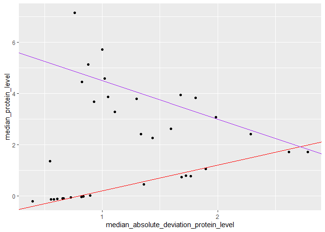

DSC1105_MONFERO_FA2
================

##### For the first set of questions, we will look again at the `CyTOF` data.

> Each row in the dataset represents a cell, and each column in the
> dataset represents a protein and the value is element i, j of the
> dataset represents the amount of protein j in cell i.

``` r
library(tidyverse)
```

    ## ── Attaching core tidyverse packages ──────────────────────── tidyverse 2.0.0 ──
    ## ✔ dplyr     1.1.4     ✔ readr     2.1.5
    ## ✔ forcats   1.0.0     ✔ stringr   1.5.1
    ## ✔ ggplot2   3.5.1     ✔ tibble    3.2.1
    ## ✔ lubridate 1.9.4     ✔ tidyr     1.3.1
    ## ✔ purrr     1.0.2     
    ## ── Conflicts ────────────────────────────────────────── tidyverse_conflicts() ──
    ## ✖ dplyr::filter() masks stats::filter()
    ## ✖ dplyr::lag()    masks stats::lag()
    ## ℹ Use the conflicted package (<http://conflicted.r-lib.org/>) to force all conflicts to become errors

``` r
data <- read.csv("cytof_one_experiment.csv", stringsAsFactors = FALSE)

head(data)
```

    ##        NKp30    KIR3DL1      NKp44    KIR2DL1 GranzymeB       CXCR6      CD161
    ## 1  0.1875955  3.6156932 -0.5605694 -0.2936654  2.477893 -0.14470053 -0.3152872
    ## 2  1.0348518  1.7001820 -0.2889611 -0.4798280  3.261016 -0.03392447 -0.4112129
    ## 3  2.9996398  6.1411419  1.9032606  0.4823102  4.277562  1.94654156 -0.5022347
    ## 4  4.2998594 -0.2211586  0.2425707 -0.4831267  3.351808  0.92622195  3.8772370
    ## 5 -0.4386448 -0.5035892 -0.1526320  0.7506128  3.194145 -0.05893640  1.0907379
    ## 6  2.0883050 -0.3992646  3.4550676 -0.5200856  4.345102 -0.36434277 -0.5705891
    ##       KIR2DS4     NKp46      NKG2D      NKG2C       X2B4     CD69 KIR3DL1.S1
    ## 1  1.94497046 4.0818316  2.6200784 -0.3573817 -0.2711557 3.849965 -0.2554637
    ## 2  3.80251714 3.7339299 -0.4832788 -0.4675984 -0.5594752 2.910197 -0.2909482
    ## 3 -0.32010171 4.5594631 -0.5069090  2.6193782 -0.4554785 3.113454  3.6613886
    ## 4 -0.16969487 4.4831486  1.9272290 -0.3110146  1.6350771 3.045998  0.2871241
    ## 5 -0.05033025 0.8379358 -0.4581674  0.9216947  1.2419054 2.644422  0.4218294
    ## 6 -0.45033591 4.0550848  3.4283565  0.6272837 -0.4157104 3.958158  0.7993406
    ##          CD2    KIR2DL5    DNAM.1         CD4        CD8       CD57      TRAIL
    ## 1  5.3529769 -0.5092906 0.8811347 -0.32347280 -0.2822405  3.3254704 -0.6084228
    ## 2  4.3132510  3.7774776 1.5406568 -0.13208167  0.9161920  2.4946442 -0.5034739
    ## 3  5.5969513  0.8128166 1.0005903 -0.59933641  1.8382744  3.9897914 -0.2749380
    ## 4 -0.5002885  0.3612212 1.2663267 -0.12568567  0.7667204  1.9950916 -0.5130930
    ## 5 -0.5479527  1.0638327 0.8722272 -0.07107408 -0.1059012  3.4291302 -0.1433044
    ## 6  5.1028564  3.0918867 0.8717267 -0.47986180 -0.2577198 -0.5784575 -0.5731323
    ##       KIR3DL2      MIP1b     CD107a      GM.CSF       CD16        TNFa
    ## 1 -0.30668543  1.2497120 -0.1295305 -0.43074102  3.9951417  0.90143498
    ## 2 -0.54320954  2.8693060 -0.1887180 -0.16283845  4.4082309  1.93590153
    ## 3  2.06488239  4.0955112 -0.1998480  3.18853825  6.0023244 -0.02336999
    ## 4  2.11247859  3.3726018 -0.5720339  0.91310694  5.8238698 -0.60793749
    ## 5 -0.02505141 -0.3099826 -0.1068511 -0.60370379  4.0122501 -0.61989100
    ## 6 -0.28337673 -0.4108283 -0.1797545 -0.06372458 -0.5832926  0.14311030
    ##           ILT2 Perforin KIR2DL2.L3.S2      KIR2DL3      NKG2A    NTB.A     CD56
    ## 1 -0.386027758 6.431983    1.22710292  2.660657999 -0.5220613 4.348923 2.897523
    ## 2  2.983874845 6.814827   -0.04141081  3.841304627  4.6771149 3.474335 3.782870
    ## 3 -0.521099944 5.099562   -0.16705075 -0.009694396 -0.4730573 5.634341 5.701186
    ## 4 -0.043783559 5.841797   -0.51753289 -0.592990887 -0.4059049 4.598021 6.065672
    ## 5  1.182703288 4.888777   -0.36251589 -0.398123704 -0.5440881 3.606101 1.966169
    ## 6 -0.003258955 3.952542   -0.20194392 -0.202592720  3.8882776 2.346275 6.473243
    ##         INFg
    ## 1 -0.3841108
    ## 2  2.7186296
    ## 3  2.5321763
    ## 4  2.4564582
    ## 5  3.1470092
    ## 6  2.8282987

##### Use `pivot_longer` to reshape the dataset into one that has two columns, the first giving the protein identity and the second giving the amount of the protein in one of the cells. The dataset you get should have 1750000 rows (50000 cells in the original dataset times 35 proteins).

``` r
revised_data_longer <- data %>%
  pivot_longer(cols = c("NKp30", "KIR3DL1", "NKp44", "KIR2DL1", "GranzymeB", "CXCR6", "CD161", "KIR2DS4", 
         "NKp46", "NKG2D", "NKG2C", "X2B4", "CD69", "KIR3DL1.S1", "CD2", "KIR2DL5", "DNAM.1", 
         "CD4", "CD8", "CD57", "TRAIL", "KIR3DL2", "MIP1b", "CD107a", "GM.CSF", "CD16", "TNFa", 
         "ILT2", "Perforin", "KIR2DL2.L3.S2", "KIR2DL3", "NKG2A", "NTB.A", "CD56", "INFg"),
         names_to = "Protein_Identity"
)
revised_data_longer
```

    ## # A tibble: 1,750,000 × 2
    ##    Protein_Identity  value
    ##    <chr>             <dbl>
    ##  1 NKp30             0.188
    ##  2 KIR3DL1           3.62 
    ##  3 NKp44            -0.561
    ##  4 KIR2DL1          -0.294
    ##  5 GranzymeB         2.48 
    ##  6 CXCR6            -0.145
    ##  7 CD161            -0.315
    ##  8 KIR2DS4           1.94 
    ##  9 NKp46             4.08 
    ## 10 NKG2D             2.62 
    ## # ℹ 1,749,990 more rows

#### Use `group_by` and `summarise` to find the median protein level and the median absolute deviation of the protein level for each marker. (Use the R functions `median` and `mad`)

``` r
median_mad_data <- revised_data_longer %>%
  group_by(Protein_Identity) %>%
  summarize(median_protein_level = median(value), median_absolute_deviation_protein_level = mad(value))

median_mad_data
```

    ## # A tibble: 35 × 3
    ##    Protein_Identity median_protein_level median_absolute_deviation_protein_level
    ##    <chr>                           <dbl>                                   <dbl>
    ##  1 CD107a                        -0.122                                    0.609
    ##  2 CD16                           5.12                                     0.874
    ##  3 CD161                          0.726                                    1.69 
    ##  4 CD2                            3.95                                     1.68 
    ##  5 CD4                           -0.204                                    0.395
    ##  6 CD56                           5.71                                     0.998
    ##  7 CD57                           3.07                                     1.99 
    ##  8 CD69                           4.59                                     1.02 
    ##  9 CD8                            2.40                                     2.29 
    ## 10 CXCR6                         -0.0581                                   0.727
    ## # ℹ 25 more rows

#### Make a plot with mad on the x-axis and median on the y-axis. This is known as a spreadlocation (s-l) plot. What does it tell you about the relationship between the median and the mad?

``` r
ggplot(data = median_mad_data) +
  geom_point(mapping = aes(x = median_absolute_deviation_protein_level, y = median_protein_level)) +
  geom_abline(slope = 1, intercept = -0.8, color = "red") +
  geom_abline(slope = -1.5, intercept = 6, color = "purple")
```

<!-- -->

``` r
print("The graph above has data points shown, but can be traced down any trends but as with two systems of linear equation instead of one clear trend (this shows other factors may play the variability of data locations within two variables considered here).
      
      This suggests that as the MAD of each protein level increases, the fluctuation of each MEDIAN's protein level converge to only one event (solution), but before that intersection; lower MAD values clearly demonstrates the variability of MEDIAN values became more observable.
      ")
```

    ## [1] "The graph above has data points shown, but can be traced down any trends but as with two systems of linear equation instead of one clear trend (this shows other factors may play the variability of data locations within two variables considered here).\n      \n      This suggests that as the MAD of each protein level increases, the fluctuation of each MEDIAN's protein level converge to only one event (solution), but before that intersection; lower MAD values clearly demonstrates the variability of MEDIAN values became more observable.\n      "

``` r
correlation <- cor(median_mad_data$median_absolute_deviation_protein_level,
                   median_mad_data$median_protein_level)
correlation
```

    ## [1] 0.1542416

``` r
print("Moreover, the relationship between MAD to the MEDIAN values are said to be positively but very weak correlation (corr = 0.1542416), meaning that any given MAD values shown is not strongly link to afford to likelihood to increases the MEDIAN values of protein levels, rather, the MEDIAN variation shows independently despite the constant increase/decrease in MAD values")
```

    ## [1] "Moreover, the relationship between MAD to the MEDIAN values are said to be positively but very weak correlation (corr = 0.1542416), meaning that any given MAD values shown is not strongly link to afford to likelihood to increases the MEDIAN values of protein levels, rather, the MEDIAN variation shows independently despite the constant increase/decrease in MAD values"

##### Next, for more practice pivoting, we will look at a dataset from `dcldata`. Install the package dcldata using

``` r
# install.packages("remotes")
# remotes::install_github("dcl-docs/dcldata")
```

> Load the package using library(dcldata).

> Load the dataset example_gymnastics_2 using the command
> data(example_gymnastics_2). Notice that the column names are of the
> form event_year.

``` r
library(dcldata)
data2 <- data(example_gymnastics_2)
```

#### Using either `pivot_longer` on its own or `pivot_longer` in combination with `separate`, `reshape` the dataset so that it has columns for `country`, `event`, `year`, and `score`.

``` r
data2 <- data.frame(
  country = c("United States", "Russia", "China"),
  vault_2012 = c(48.1, 46.4, 44.3),
  floor_2012 = c(45.4, 41.6, 40.8),
  vault_2016 = c(46.9, 45.7, 44.3),
  floor_2016 = c(46.0, 42.0, 42.1)
)

data2 %>%
  pivot_longer(cols = c(starts_with("vault"), starts_with("floor")), names_to = "event", values_to = "event_score") %>%
  separate(col = event, into = c("type", "year"), sep = "_") %>%
  arrange(type, year)
```

    ## # A tibble: 12 × 4
    ##    country       type  year  event_score
    ##    <chr>         <chr> <chr>       <dbl>
    ##  1 United States floor 2012         45.4
    ##  2 Russia        floor 2012         41.6
    ##  3 China         floor 2012         40.8
    ##  4 United States floor 2016         46  
    ##  5 Russia        floor 2016         42  
    ##  6 China         floor 2016         42.1
    ##  7 United States vault 2012         48.1
    ##  8 Russia        vault 2012         46.4
    ##  9 China         vault 2012         44.3
    ## 10 United States vault 2016         46.9
    ## 11 Russia        vault 2016         45.7
    ## 12 China         vault 2016         44.3
